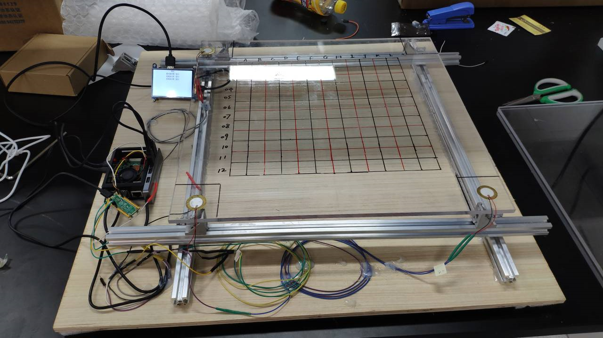
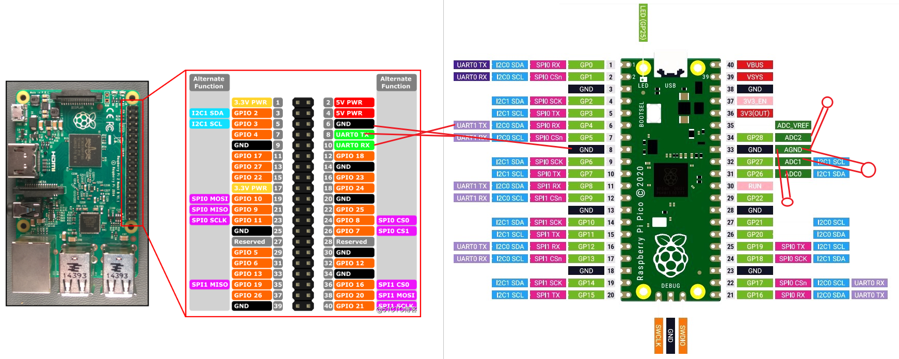

# 2023 电赛 F题 声源定位

> by 高自然，徐思琦，叶一帆
> [视频展示](https://www.bilibili.com/video/BV1sp4y1J7xi)

## 本题采用的器材：

压电陶瓷片

磁铁

超声波耦合剂

亚克力平板

声卡（推荐使用信号发生器代替）

pico pi w（其他可多通道采样单片机或具有该功能元器件也可）

树莓派 4B（可以运行神经网络的运算单元均可）

其中：

压电陶瓷片的作用为：声电转化与电声转化部件

磁铁，亚克力平板：题目要求

超声波耦合剂：保证压电陶瓷可以很好的接收到亚克力平板传出的声音振动信号与将声音信号传入亚克力平板

声卡：将wav音频文件转化为模拟信号驱动压电陶瓷片发声

> 此处声卡的效果很差，由于声卡似乎会过滤过高频率的信号，并且功率不够，导致发出的扫频信号失真并且声音过小增大信号接收难度。建议使用自行设计的扫频信号发生器

pico pi w：该单片机具有3个模拟信号采样通道可以很好的进行信号的同步采样（在这里同步信号是非常重要的，后续会说明）

树莓派4B：接收来自pico pi w 的采样信号，并分析数据（使用构建的神经网络）

### 项目总体结构

## 声音的接收与声源探测和定位

声音的接收使用压电陶瓷，连接pico的adc采样端口进行采样

由于micro-python的低效与不稳定，这里我们使用cpp进行pico pi的编程，语法类似arduino

### 串口通信速率

串口通信效率很低，最高速率为115200bit/s，即7200数据/s，分给每个采样口后2400数据/s，查表可得亚克力中的声速约为2600m/s，即两次采样中间隔1.25m的距离，远大于我们所需要的5cm的精度，故我们在检测与收集信号时不进行信号的传输

### 敲击信号检测

在pico数据处理中，我们首先提取了关键帧（敲击前200次采样与敲击后400次采样）作为需要传输的数据，敲击信号作为触发信号（考虑敲击信号会导致声音的幅值异常增大，我们可以通过检测声音幅值的大小去判断是否受到敲击），使用环形数组数据结构覆盖写入，在检测到敲击信号后循环400次写入，使得环形数组中存储检测到的敲击前200次和敲击后400次的信号。

### PICO编程

基础教程：[pico micro-python 玩法](http://92maker.com/?p=1017) [pico c++编译环境搭建](https://blog.csdn.net/lv__you/article/details/121942720) [pico 采样与串口通信参考](https://zhuanlan.zhihu.com/p/391731291)

### pico采集信号

使用pico将检测到的敲击信号采集并在采集完成后使用串口通信回传至树莓派，在树莓派使用训练好的神经网络进行学习，输出最终结果

过程中存在的坑：

- 串口通信速率调到最大避免通讯时间过长导致的意外情况
- 尽量通过控制两次采样之间执行的代码量使得每次采样间距相同
- 树莓派端使用的tensorflow版本和训练使用的tensorflow版本一定要相同！！！建议使用python3.7+tensorflow1.4
- 进行数据集的收集时务必保护好自己的耳朵，每个点进行10次采样收集到的数据集训练正确率约为0.95

## 理论论证

### pico采样率计算：

相距30cm的两个压电片获取到的信号相差15个采样点，计算得采样频率约为130000hz，两次采样点之间的间距为2cm，精度满足要求

## 后续题目思路：

采用类似方法，使用功率放大器或大功率信号发生器产生扫频信号，使用pico进行采样并放入神经网络进行学习接收到的扫频信号波形。此处采样频率高达130000hz，高于一般音频信号（48khz），理论上可以较好还原收集到的信号并且进行比对。

### 接线方式与引脚图：

# 写在最后

电赛第一天光速换题+逛华强北属实时没有想到，不过快乐就完事啦\~感谢队友的支持~
